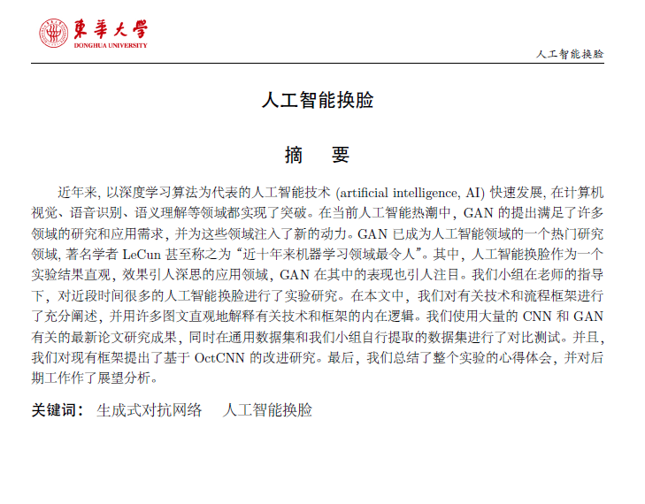

# 东华大学课程大作业论文模板

这是为撰写东华大学课程作业、课程设计而准备的 XeLaTeX 模板，非官方出品。生成的论文文件参见 [thesis.pdf](./thesis.pdf)。

## 论文效果

      

## 问题诊断

编译失败时，可以尝试手动逐次编译。
结合文档 [document.pdf](./document.pdf) 中的说明，有助于定位故障。

    xelatex -no-pdf thesis
    biber --debug thesis
    xelatex thesis
    xelatex thesis

## 推荐使用 `MiKTeX`

[Install for \*nix](https://miktex.org/howto/install-miktex-unx)

> 如果是安装在用户级别, 记得 `~/bin` 加入 `$PATH`
